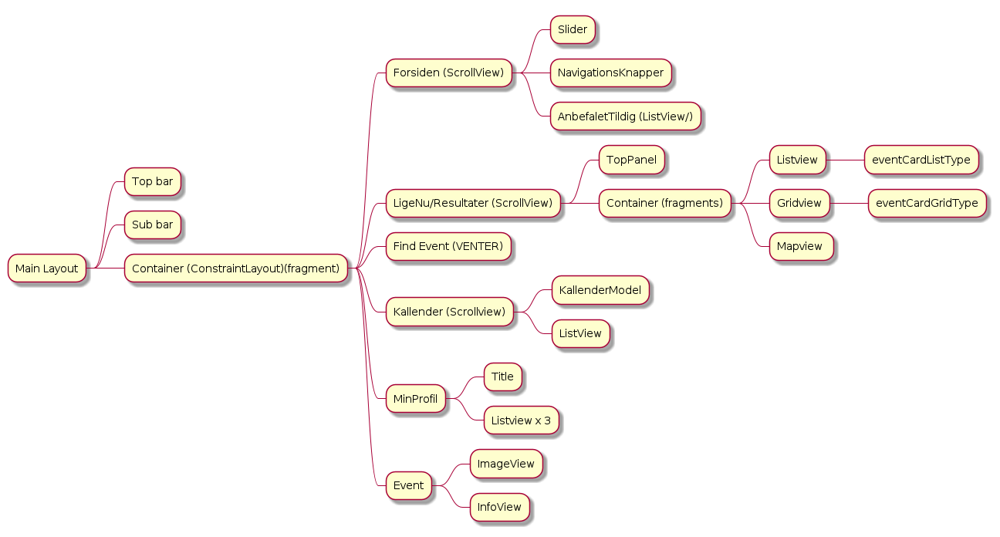

# Readme

## TODO

- Fragment_burger_fragment (Done)
- Fragment_find_event_interface (Done)
- Fragment_front_page (Done)
- fragment_kommende_events (Thomas)
- fragment_kontakt_os (Oliver)
- fragment_min_profil
- fragment_min_profil_kalender
- fragment_om_os
- fragment_saved_events
- fragment_single_event
- fragment_tip_os
- right_now_fragment

